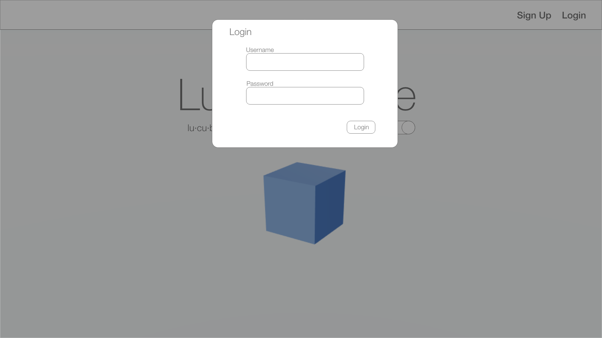
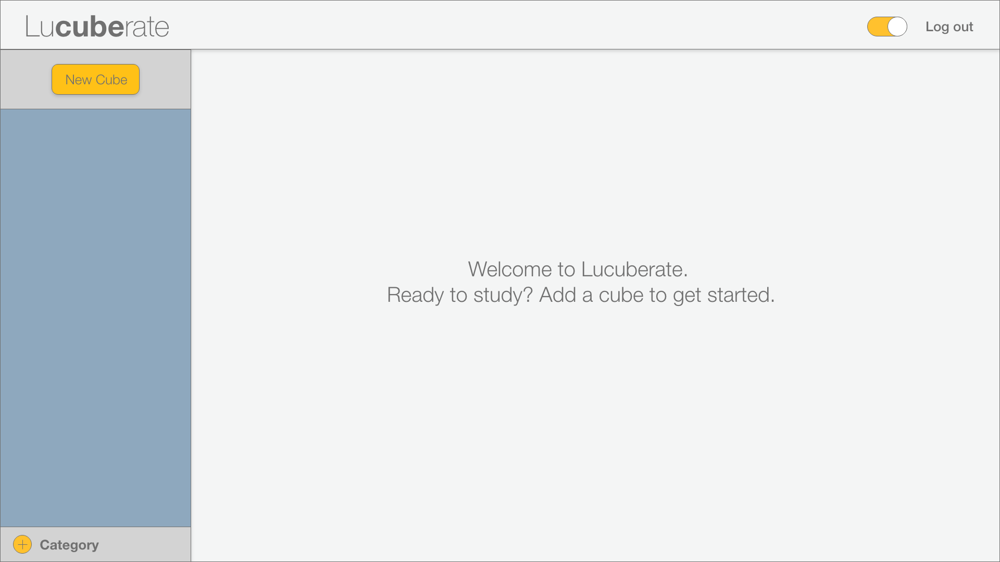
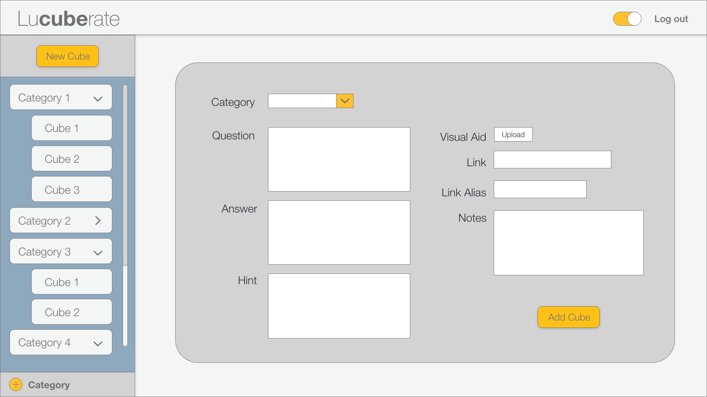
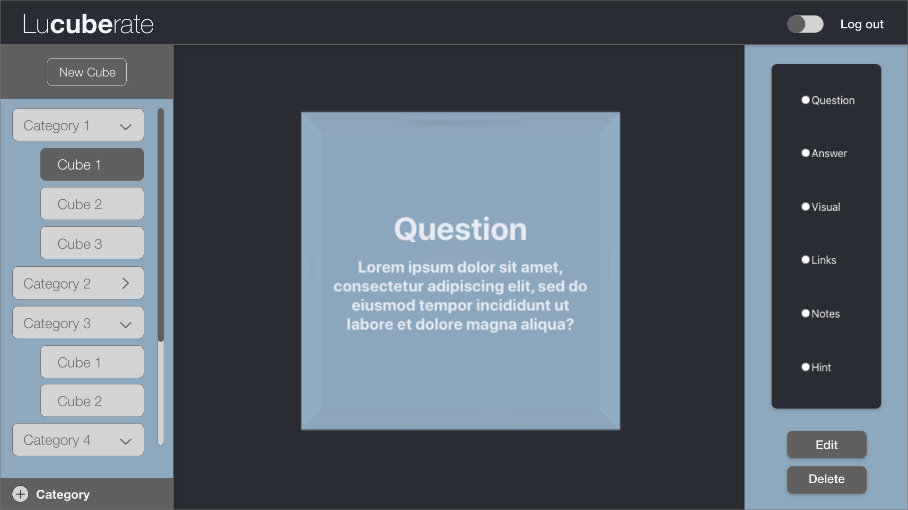

# LuCUBERate

LuCUBERate leverages the convenience of a flash card into a third dimension. We allow more space and freedom for the way that you learn.
Our name LuCUBERate is a play on the word 'lucubrate', which means to write or study, especially by night.

This project was bootstrapped with Create React App.

## User Stories
* User will land on splash page and be able to sign up or login using links on nav bar in upper right hand corner of the screen.
* User may interact with cube in 3d background. When user hovers over cube, cube will change color slightly, giving user a hint to the interactive scene. User can click and drag to move the cube around.
* Once user has signed up or logged in, user will be directed to the dashboard and will be prompted to add a new cube (if they have no cubes saved), or to select a cube if they already have some populated in the list on the left side of the screen.
* User can add a new cube by clicking on the 'New Cube' button in the upper left corner of the screen. This button will make a form appear on the dashboard and the input fields will have placeholders prompting the user to fill out each side of the cube.
* Once the form has been submitted, the new cube will be added to the cube list and the user will be redirected to that cube's show page.
* While on a cube's show page, User is able to interact with the cube by clicking on the radio button on the top of the screen in order to navigate to the different faces of the cube.
* While on a face of a cube, user can hover on the face to make the face opaque and easier to read.
* While on the 'Visual Aid' side of the cube, user will be able to hover over the image in order to expand it.
* The link on the 'Link' side of the cube, will open in a new browser tab when the user clicks on it.
* User can edit or delete the cube by clicking the buttons in the upper right corner of the page.
* When the user clicks on the edit button, a form that is pre-populated with that cube's info will be presented. Once edits are made and the form has been submitted, the user will be redirected to that cube's show page.
* When the user clicks on the delete button, the user will be prompted to make sure the user actually intends to delete the cube. If the user deletes the cube, the user will be redirected to the dashboard and will be prompted to select or make another cube.
* User can navigate through the cubes using the list on the left side of the page. When a user navigates to a different cube, the cube will spin back to the face of the cube that contains the question.
* User can navigate back to the splash page while logged in by clicking on the brand name in the upper left corner. While logged in, a 'dashboard' button will be present in the navbar on the splash page to take the user back to the dashboard.
* User can logout with the button in the upper right corner of the page.

## Wireframes

## Technologies Used

### Main Stack
* MongoDB
* Express
* React
* Node.js

### Back End Dependencies
* Mongoose
* Express-Session
* Bcrypt
* Cors
* Dotenv

### Front End Dependencies
* React-Router-DOM
* Three.js
* React-Three-Fiber
* React-Spring
* Drei
* Bootstrap

